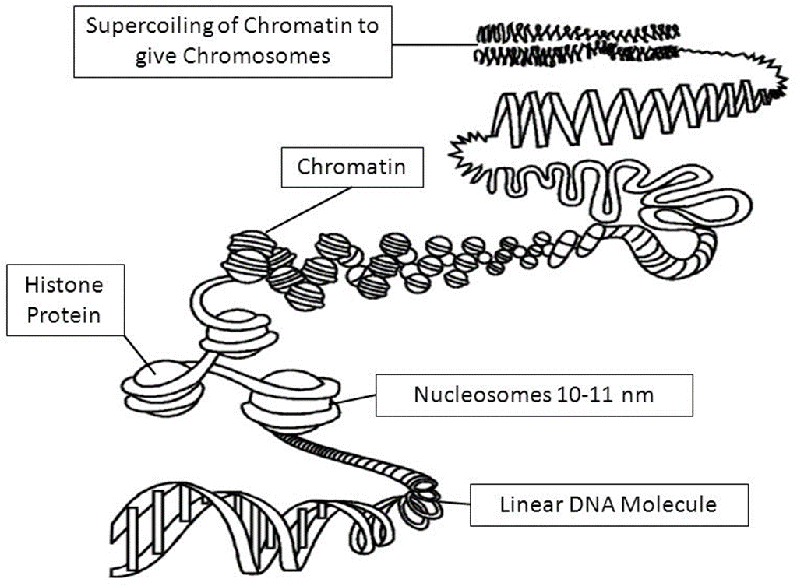
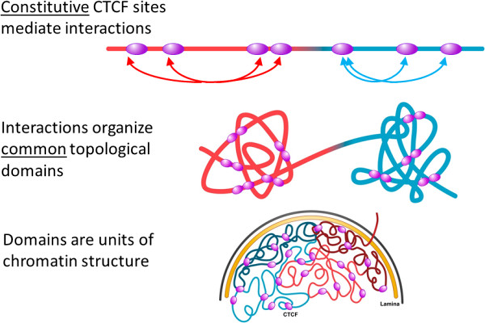
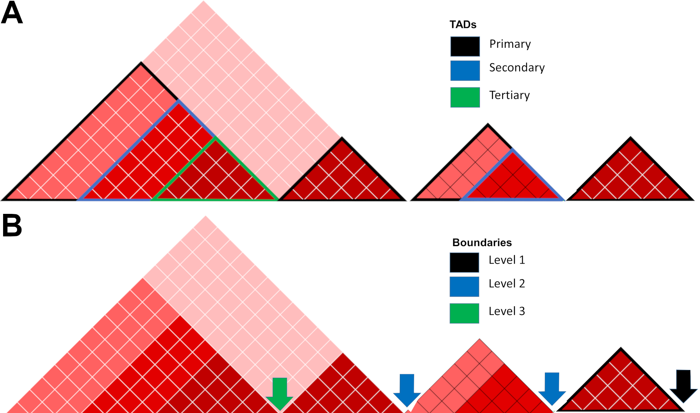
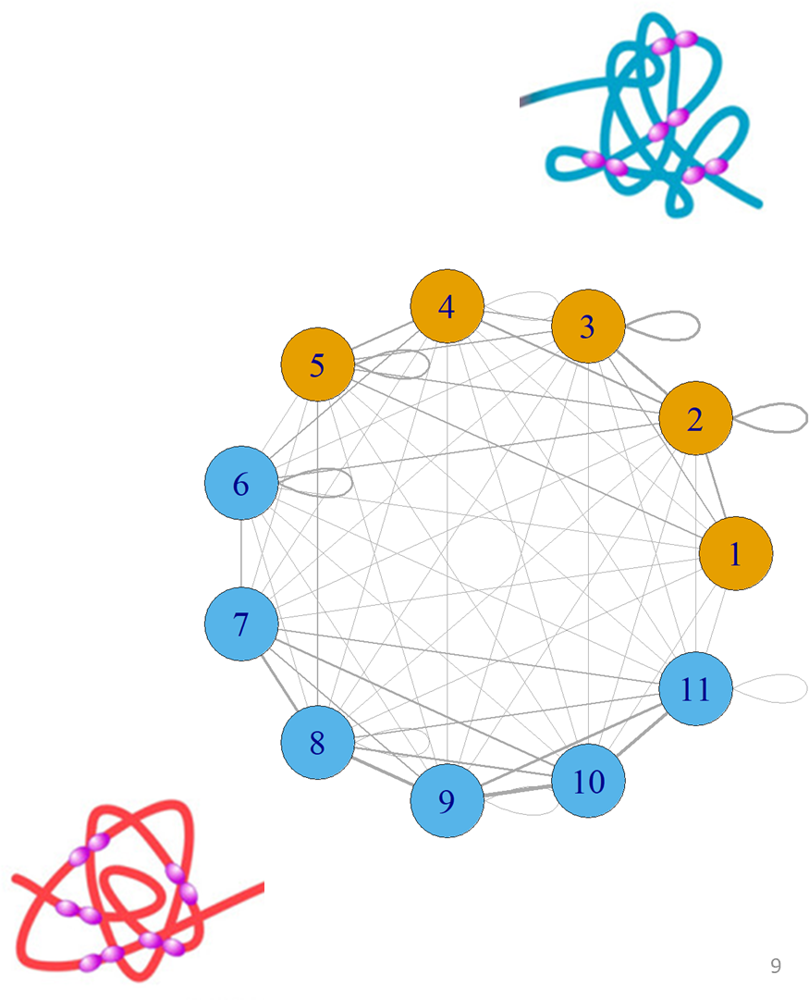
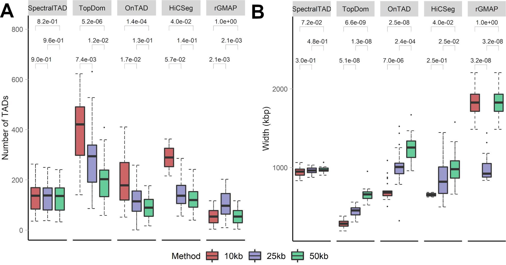
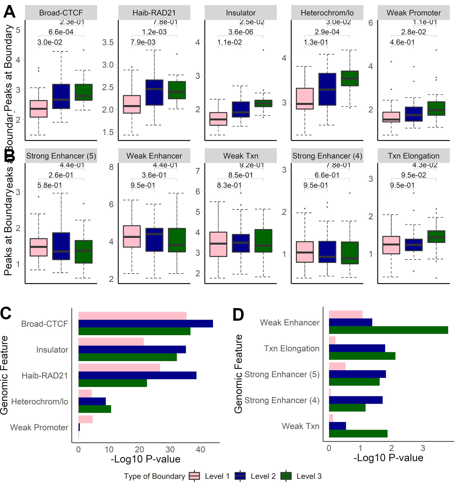
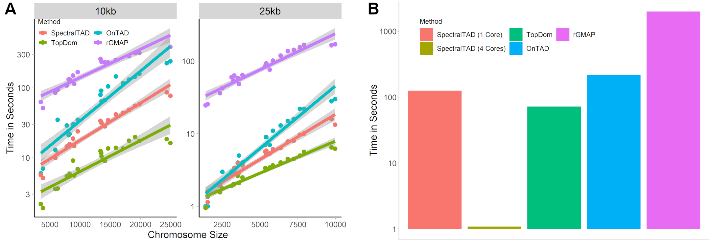

## The Genome

::: columns
:::: column

- The genome refers to the entirety of an organisms DNA and genetic information
- It is made up of structures called chromosomes which contain molecules of DNA
- In total, each person has 46 chromosomes with each containing unique genetic information

::::
:::: column

{width=100%;height=100%}

::::
:::

## 3D Genomics
 
::: columns
:::: column

- **Genome folding** enables interaction between distant genomic regions
- **Hi-C sequencing** (Chromatin Conformation Capture technology) allows for identification of genomic interactions genome-wide

::::
:::: column

{width=100%;height=100%}

::::
:::

## Hi-C Data as a matrix

- The genome (chromosome) is binned to equally sized regions
- Region size (resolution) is determined by sequencing depth
- Data is represented by a symmetric matrix of contacts $C_{ij}$ where entry $ij$ corresponds to the number of times region $i$ comes into contact with region $j$

## Hi-C Data as a matrix

\begin{center}
\includegraphics{img/hicmatrix.png}
\end{center}

## Topologically Associated Domains (TADs)

::: rows
:::: row

- TADs are regions of the genome with high level of interactions within and low level of interactions between them
- Boundaries are associated with specific genomic features (CTCF, cohesin, mediator)
- Can be nested (TADs containing sub-TADs)

::::
:::: row

\begin{center}
\includegraphics[width=303px,height=363px]{img/TAD_Plot.png}
\end{center}

::::
:::

## Why are TADs Important?

- Act as walls inhibiting promoter-enhancer interaction and gene expression
- Disruption is potential mechanism for diseases (e.g., cancer)
- Can be altered using CRISPR
- Established early in development and highly conserved
- Many possible other functions (Largely unexplored)

## TADs are hierarchical

::: rows
:::: row

- Organized in a hierarchy
- Characterized by large “meta-TADs” containing small “sub-TADs”
- Level of hierarchy has an effect on biological relevance

::::
:::: row

\begin{center}
\includegraphics{img/Hierarchical_TADs.png}
\end{center}

::::
:::

## Types of Boundaries and TADs 

{width=100%;height=100%}

## Graph Representation of 3D Data

::: columns
:::: column

- Hi-C data has a natural graph structure, defined by vertices $V$ and edges $E$
    - **Vertices** are genomic regions
    - **Edges** represent interaction strength between any pair of regions

- Vertices and edges are stored in an **adjacency matrix** $A_{ij}$ where $ij$ is the number of edges between a given set of vertices $ij$

::::
:::: column

{width=100%;height=100%}

::::
:::

## Traditional Spectral Clustering
 

- Specifically designed to cluster graphs
- Works by projecting the data into a lower-dimensional space
- Excels on noisy and non-normally distributed data (Hi-C data)
- Clusters the adjacency matrix $A_{n \times n}$

## How to perform spectral clustering

- Calculate the Laplacian:
$$D = diag(A\mathbf{1_n})$$
$$\bar{L} = D^{-\frac{1}{2}}AD^{-\frac{1}{2}}$$
- Calculate the eigenvectors of the Laplacian matrix (graph spectrum):
$$\bar{L}\mathbf{v} = \lambda\mathbf{v}$$
- Normalize the eigenvectors and cluster

## Spectral clustering with eigenvector gaps

- Rows and columns of contact matrices are naturally ordered
- TADs are continuous 
- Ordering allows us to reframe clustering as finding cut points
- We propose a simple, novel, approach to clustering ordered data using gaps between consecutive eigenvectors

## Step 1: Plot the non-normalized eigenvectors

\begin{center}
\includegraphics[width=320px]{img/Norm_Eigs1.png}
\end{center}

## Step 2: Project on to Unit Circle
 
\begin{center}
\includegraphics[width=320px]{img/Norm_Eigs2.png}
\end{center}

## Step 3: Find the k-largest gaps and partition

\begin{center}
\includegraphics[width=320px]{img/Norm_Eigs3.png}
\end{center}

## Step 3: Find the k-largest gaps and partition

\begin{center}
\includegraphics[width=320px]{img/Norm_Eigs4.png}
\end{center}

## Silhouette Score

- A strong TAD should have a high level of interactions within the TAD and a low level of interactions between the TAD
- This can be quantified using silhouette score:

$$s(i) = \frac{b(i)-a(i)} {max(a(i), b(i))}$$

$b(i)$ is the mean distance between point $i$ and all values in its cluster and $a(i)$ is the mean distance between point $i$ all values outside of its cluster

- Here, we define distance between two points $i$ and $j$ as $\frac{1}{1+C_{ij}}$

## Windowed Spectral Clustering

- We know the biologically maximum TAD size (2 million bp)
- We can use a 2 million bp sliding window to perform spectral clustering and aggregate
- Advantages of the sliding window
  - Reduced cubic complexity of spectral clustering $(O(n^{3}))$ to linear complexity $(O(n))$
  - Naturally discards noisy interactions at large genomic distances

## SpectralTAD algorithm
 
1. Cut a window from the matrix equal to the maximum TAD size (2Mb)
2. Find the graph spectrum of the window and calculate eigenvector gaps
3. Find $n$-largest gap values
4. Find the set of clusters that maximize the silhouette score
5. Slide the window to the next group of loci and repeat

## Determining a hierarchy of TADs

- TADs are hierarchical in nature (organized into large meta-TADs with sub-TADs within them)
- Need to find sub-TADs within those detected by sliding window
- To find sub-TADs, we use a novel metric called boundary score
- **Boundary score** is just the z-score for each eigenvector gap

## Determining a hierarchy of TADs

- For each initial TAD detected:
  - Calculate the boundary score for each consecutive pair of regions
  - If any boundary score is greater than 1.96, this is a sub-TAD boundary
  - Repeat for all sub-TADs until no z-score is greater than 1.96

## TAD Calling

- Refers to methods designed to find TAD boundaries
- Good TAD callers must satisfy three criteria:
  - Be robust to Hi-C data imperfections (resolution, sparsity, sequencing depth)
  - Detect biologically significant, hierarchical TAD boundaries
  - Be fast
- We compared SpectralTAD against four TAD callers:
  - TopDom
  - HiCSeg
  - OnTAD
  - rGMAP

## SpectralTAD is robust to resolution

{width=100%;height=100%}

## Sparsity

- One of the main biases in HiC data
- Characterized by random zeros in the contact matrix
- Simulated by replacing a certain percentage of the contact matrix with zeros

## SpectralTAD is robust to sparsity

- 25 simulated matrices with pre-defined TADs (HiCToolsCompare)
- The percentage of the matrix replaced with zeros
- Jaccard similarity between the detected and pre-defined TADs

\begin{center}
\includegraphics[width=210px]{img/Sparsity_Comb.png}
\end{center}

- Our method is better than other methods at all levels of sparsity (except HiCseg, which detects least biologically significant TADs)

## SpectralTAD is robust to sequencing depth

- The fraction indicates the proportion of contacts removed. 

\begin{center}
\includegraphics[width=210px]{img/Down_Comb.png}
\end{center}

- Our method outperforms all other methods at all levels of downsampling (excluding HiCSeg, which detects least biologically significant TADs)

## Hierarchical TAD boundaries differ

::: columns
:::: column

- Boundaries shared by two TADs (Level 2) or three TADs (Level 3) are expected to be more biologically significant
- Average number (A) and enrichment (C) of CTCF, RAD21 peaks, insulator and heterochromatin states are higher for shared TAD boundaries 
- Average number (C) and enrichment of enhancer marks are lower for shared TAD boundaries

::::
:::: column

{width=100%;height=100%}

::::
:::

## SpectralTAD is fast
 
A) Runtimes for various TAD callers at different chromosome sizes
B) Runtimes for various TAD callers across all chromosomes (25kb data)

{width=100%;height=100%}

## Side-by-side comparison

\begin{center}
\includegraphics[width=310px]{img/Supplemental_Fig_S2.png}
\end{center}

## SpectralTAD Package

- Fully functional and available at http://bioconductor.org/packages/SpectralTAD/
- Two main functions: `SpectralTAD` and `SpectralTAD_Par` (parallelized)
- Input: three types of contact matrices ($n \times n$, sparse and $n \times (n+3)$) in text format, import from `.hic` and `.cool` files supported
- Output: A 3-column BED file for each hierarchy level
- Visualization options include output for `Juicebox`, `HiCExplorer`

## Summary

- We propose a new approach for TAD detection based on spectral clustering, `SpectralTAD`
- `SpectralTAD` implements two novel methods (sliding window and eigenvector gap clustering) for improving clustering on ordered data with size restrictions
- Benchmarked against existing methods, `SpectralTAD` has shown a significant improvement on several criteria
- `SpectralTAD` has been released as an R package and is available on Bioconductor

## Learn more

\begin{center}
\includegraphics[width=70px]{img/SpectralTAD_QR.png}
\includegraphics[width=320px]{img/SpectralTAD_Biorxiv.png}
\end{center}

\small
- `SpectralTAD` is available at http://bioconductor.org/packages/SpectralTAD/
- Slides are available at https://github.com/mdozmorov/Talk_JSM2019
- Preprint is available at https://www.biorxiv.org/content/10.1101/549170v2

\begin{center}
\includegraphics[width=150px]{img/funding.png}
\end{center}

<!--
\begin{center}
\qrcode{https://www.biorxiv.org/content/10.1101/549170v2}
\end{center}
-->
